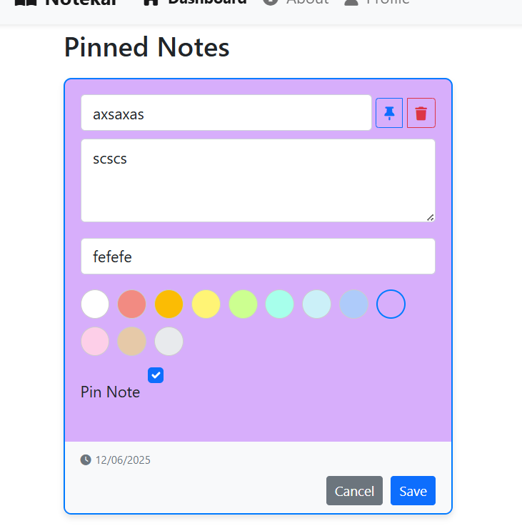

# 📓 Notekar Web Application    (  https://notekar-frontend1.onrender.com )

**Notekar** is a secure, full-stack web application designed to help users create, manage, and organize personal notes in the cloud. With intuitive UI/UX, robust authentication, and real-time data operations, Notekar provides a seamless note-taking experience.

---

## 🌟 Key Features

- ✅ **User Authentication** – Secure registration and login using JSON Web Tokens (JWT).
- 🗃️ **Personalized Note Management** – Create, read, update, and delete notes tailored to each authenticated user.
- 📌 **Note Pinning** – Pin important notes to the top for quick access.
- 🎨 **Color Themes** – Assign various colors to notes for better organization and visual distinction.
- 🔄 **Sorting Options** – Sort notes by date or title in ascending or descending order.
- 📊 **View Modes** – Toggle between grid and list views for a personalized display of notes.
- 🧠 **Modal-Based Editing** – Edit notes efficiently with a modern modal popup interface.
- 💾 **Persistent Storage** – Notes are stored in a MongoDB database, accessible only by the authenticated user.
- 📱 **Responsive UI** – Clean and responsive frontend built with modern web technologies.

---

## 🖥️ Screenshots

### 🔐 Login Page

Secure user login screen.


### 📝 Registration Page

New users can sign up to start using Notekar.


### 🏠 Home / Dashboard

Authenticated users can view, edit, and delete their notes.


### ✏️ Update Note Modal

Modern modal interface for editing existing notes.


---

## 🛠️ Technology Stack

### Frontend

- React.js
- HTML5 & CSS3
- Bootstrap
- Framer Motion (for animations)
- JavaScript (ES6+)

### Backend

- Node.js
- Express.js

### Database

- MongoDB with Mongoose

### Authentication

- JWT (JSON Web Tokens)
- bcrypt.js for password hashing

---

## 🧑‍💻 Getting Started

### Prerequisites

- Node.js and npm installed
- MongoDB instance (local or cloud)

### Installation

1.  **Clone the repository**

    ```bash
    git clone https://github.com/ayushmanmishra18/Notekar # You might want to update this to your own repo URL
    cd notekar # Or 'cd notekar' if you rename the root folder
    ```

2.  **Install dependencies**

    Run the `install-dependencies.bat` script in the root directory:
    ```bash
    install-dependencies.bat
    ```
    This script will install all necessary packages for both frontend and backend.

3.  **Set up environment variables**

    *   Create a `.env` file in the **root directory** (for frontend) with the following:

        ```env
        REACT_APP_BACKEND_URL=http://localhost:5000
        ```

    *   Create a `.env` file in the **`backend` directory** with the following:

        ```env
        PORT=5000
        MONGODB_URI=mongodb://localhost:27017/notekar # Update if your MongoDB URI is different
        JWT_SECRET=your_jwt_secret_key_here # **IMPORTANT: Change this to a strong, unique secret!**
        ```

4.  **Run the application**

    First, ensure your MongoDB server is running.

    Then, run the `start-servers.bat` script in the root directory:
    ```bash
    start-servers.bat
    ```
    This script will open two terminal windows, one for the backend server and one for the frontend development server.

    *   Backend will be available at `http://localhost:5000`
    *   Frontend will be available at `http://localhost:3000`

---

## 🛡️ Security

- All API routes are protected using JWT.
- User passwords are hashed and salted using bcrypt.
- CORS and input validation implemented for secure data handling.

---

## 🤝 Contributing

Contributions are welcome! Please fork the repository and create a pull request.

---

## 📄 License

This project is licensed under the MIT License - see the [LICENSE](/LICENSE) file for details.

---


